<h2>Documentation – Installation et utilisation de Eyes of Application – Windows</h2>

Dans cette documentation, nous verrons comment installer EOA ainsi que son utilisation sur Windows.

<h1>Partie 1 – Installation</h1>

Récupérez EOA sur GitHub via le lien suivant : https://github.com/EyesOfNetworkCommunity/eyesofapplication/
Extrayez le dossier téléchargé. Pour lancer l’installation il vous faudra tout d’abord signer le setup.bat. Pour ce faire, faites un clic-droit sur setup.bat, allez dans Propriété. Cochez la case Débloquer pour que Windows vous autorise l’utilisation du script, ceci est une sécurité de Windows pour prévenir du lancement de script malveillant.

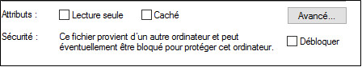

Lancez ensuite le fichier setup.bat.
Renseignez les informations demandées selon vos critères :

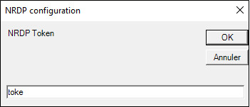

Vous avez à présent un nouveau dossier à la racine de votre disque.

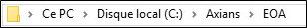

Dirigez-vous vers ce dossier, puis dans Apps. Ouvrez www.eyesofnewtork.fr.ps1 dans Notepad++. Modifiez les éléments suivants en fonction de votre configuration :

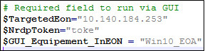

$TargetedEON : Adresse IP de votre EON
$NrdpToken : Votre token
$GUI_Equipement_InEON : Nom de votre hôte Windows sur EON

Dé-commentez la ligne correspondant à votre version de Firefox installé sur votre poste Windows 10.
Dans l’exemple, le poste a la version 32 bits de Firefox d’installé.

Enfin, renommez le $Hostname :

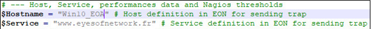

<h1>Partie 2 – Configuration SSH</h1>

Le programme utilise une connexion SSH via une paire de clés. Il vous faut créer cette paire de clés, pour ce faire rendez-vous sur votre serveur EON. Dirigez-vous dans le dossier /srv/eyesofnetwork/eon4apps/.ssh. Utilisez la commande ssh-keygen –t dsa.

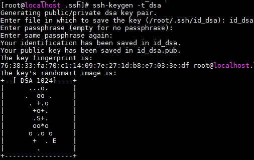

Une fois ceci fait, retournez sur votre poste Windows 10. Ouvrez PowerShell en administrateur et lancez cette commande pour récupérer la clé et l’envoyer dans le bon dossier.

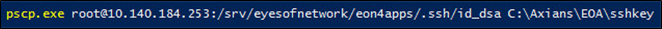

Après la récupération de votre clé, allez dans le dossier C:\Axians\EOA\sshkey, et lancez puttygen.exe. Importez la clé :

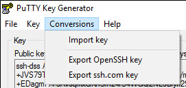

Puis sauvegardez-la :

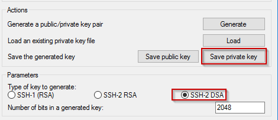

<h1>Partie 3 – Configuration d’Eyes Of Network</h1>

Maintenant, il faut configurer EON pour qu’il récupère les informations venant d’EOA. Rendez-vous sur la page web d’EON. Avant de créer et configurer l’hôte, il vous faut créer la commande check_dummy. Le plugin est présent dans EON mais la commande n’existe pas sur l’interface web. Si ce n’est pas le cas, reportez-vous à la documentation de création de commandes.

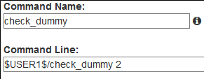

Rajoutez l’hôte :

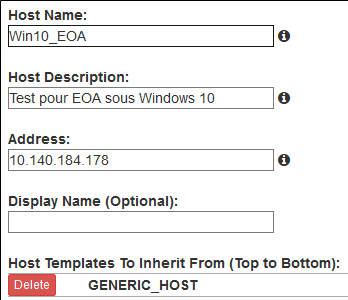

Créez ensuite les services suivants, et configurez-les comme suit :

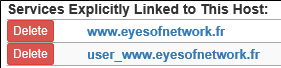
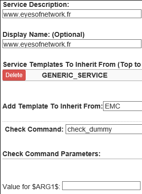

Ces services récupèrerons les informations qu’enverra EOA à EON, ce sont des services passifs.

<h1>Partie 4 – Utilisation et Tests</h1>

Maintenant que la configuration est terminée, passons à l’utilisations d’EOA. EOA Simule un utilisateur, le script fait une recherche d’image puis clique et si elle ne la trouve pas, l’envoie à EON. Rendez-vous sur votre poste Windows 10.
Lancez l’application EyesOfApplicationGUI.exe, et laissez-la travailler quelques instants. Elle ouvrira le site www.eyesofnetwork.fr sur Firefox et tentera de cliquer sur le bouton téléchargement du site. Si elle n’y arrive pas, elle envoie l’erreur à EON en prenant une capture d’écran.
Pour vérifier que tout s’est bien passé, vérifiez sur EON le service non-user de votre hôte :

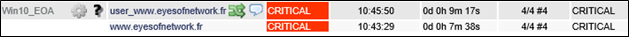

Si comme ici, vous obtenez CRITICAL à droite, c’est que EOA n’a rien envoyé et que la commande a échouée. Attention : Il faut que vous ayez lancé EOA avant la vérification et attendu que le programme ait fini, sinon il est normal que cela affiche CRITICAL.
Pour savoir ce qu’il s’est passé, aller dans les logs dans le dossier suivant et ouvrez dans Notepad++ le fichier présent :

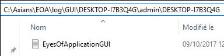

Allez à la fin du fichier de Logs, et déterminez la commande PowerShell envoyée commençant ainsi :

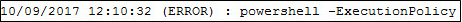

Vérifiez dans la commande que les informations des options sont les bonnes, tel que url, token, hostname, et service. Corrigez les erreurs dans cette commande et dans le script www.eyesofnetwork.fr.ps1 du début de cette documentation, et lancez la commande corrigée en manuel :

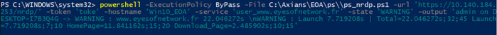

Vous devriez obtenir ceci :

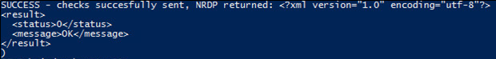

Pour vérifier que la commande a bien fonctionnée sur EON, allez sur le lien suivant https://10.140.184.253/nrdp/. Entrez le nom de votre token (ici toke) et cliquez sur Submit Check Data :

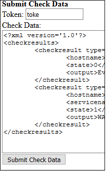

Vous devriez obtenir ceci :

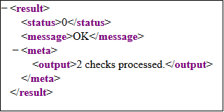

Une fois la commande lancez dans PowerShell, allez dans EON, et vérifiez rapidement que vous avez bien ceci dans user_www.eyesofnetwork.fr :

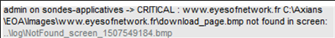

La commande envoyée manuellement a alors fonctionné. Si vous obtenez ceci également avec le GUI, tout fonctionne.
Si l’image est trouvée, vous obtenez alors ce résultat :

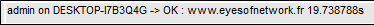

